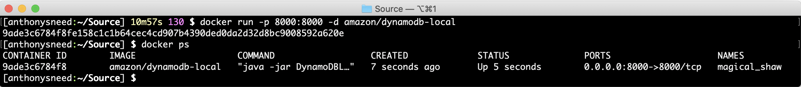
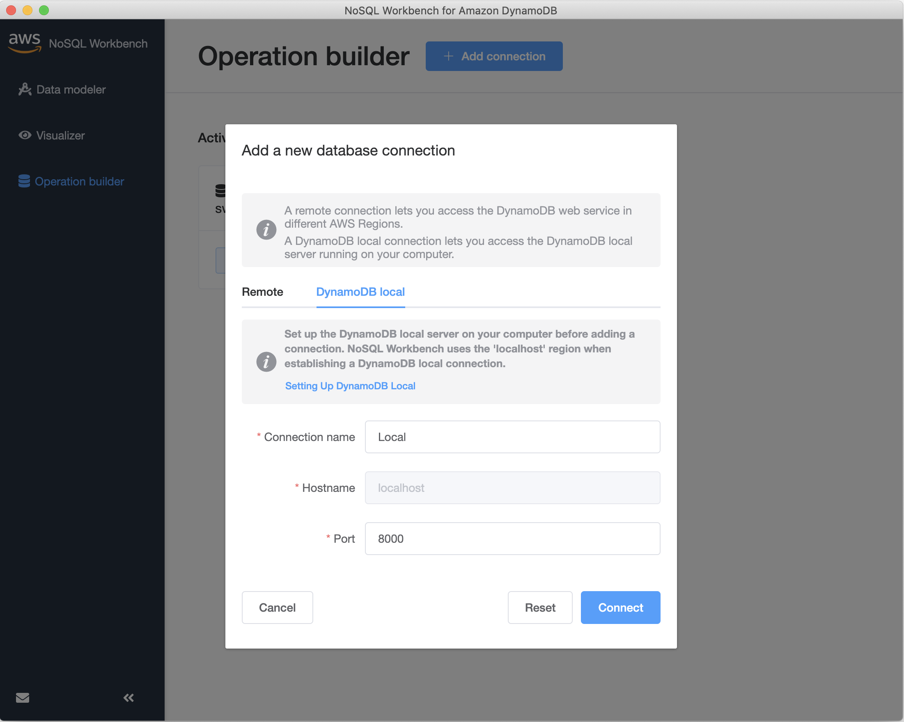
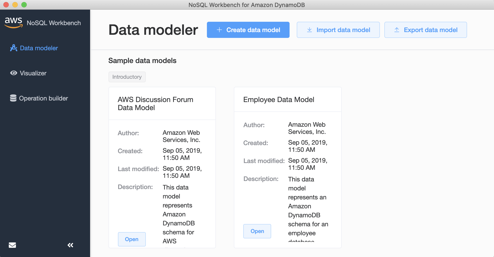
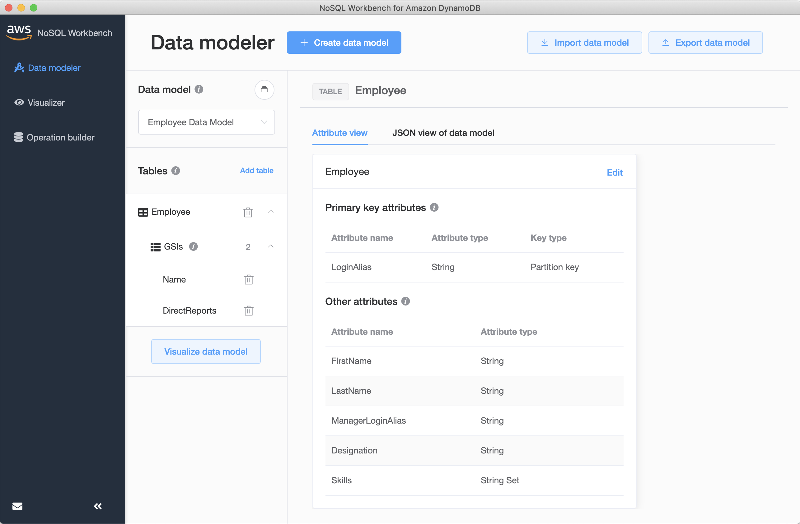
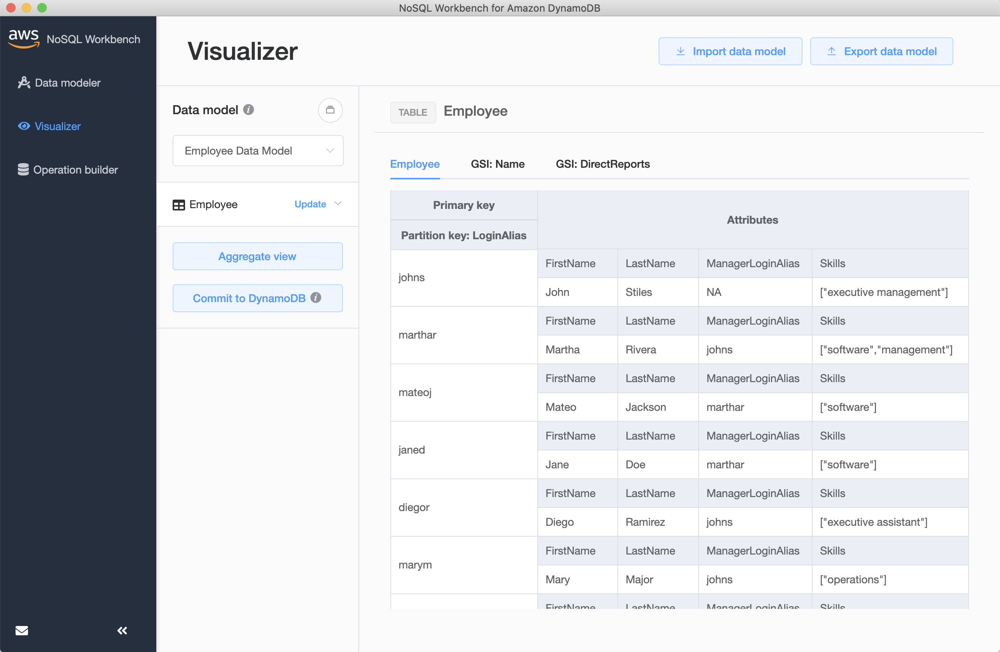
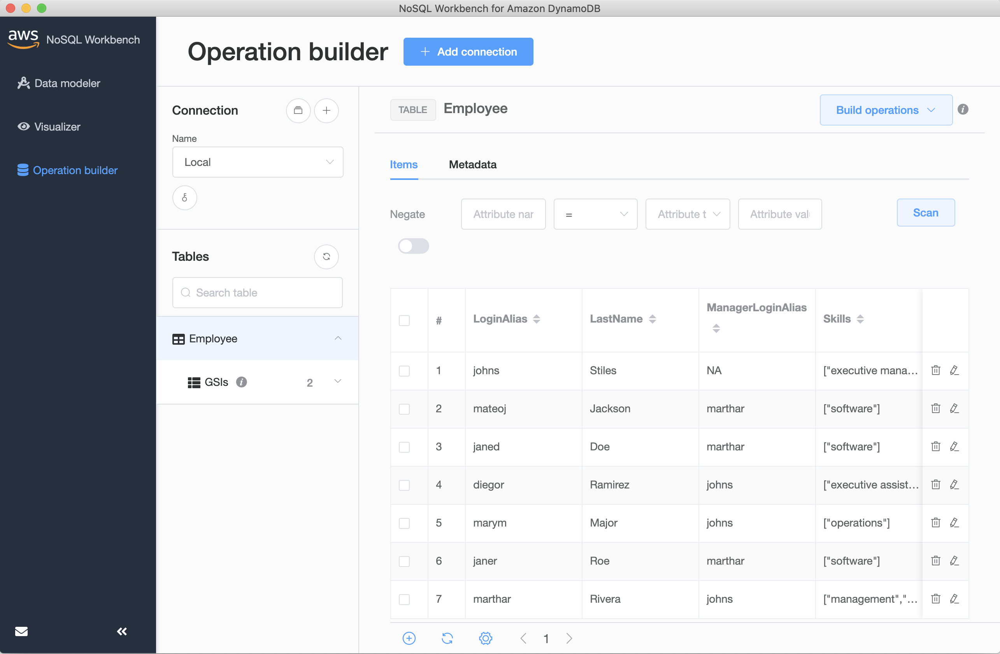

# Using DynamoDb with .NET Core

## Prerequisites

- Install [Docker Desktop](https://www.docker.com/products/docker-desktop).
  - To run Docker in Windows on Parallels for Mac [enable nested virtualization](https://kb.parallels.com/en/116239).
  - To run Docker on Windows [enable Hyper-V](https://docs.microsoft.com/en-us/virtualization/hyper-v-on-windows/quick-start/enable-hyper-v#enable-the-hyper-v-role-through-settings)
- Install [NoSQL Workbench for Amazon DynamoDB](https://docs.aws.amazon.com/amazondynamodb/latest/developerguide/workbench.settingup.html).
- Install [.NET Core SDK](https://dotnet.microsoft.com/download) 3.1 or greater.
- Install [dotnet aspnet-codegenerator](https://docs.microsoft.com/en-us/aspnet/core/fundamentals/tools/dotnet-aspnet-codegenerator?view=aspnetcore-3.1).

## DynamoDb Local

- Run DynamoDb Local with Docker.
  - Start DynamoDb Local. This command will mount a volume where a shared database will reside.
    ```
    docker run -d -p 8000:8000 -v $(pwd)/local/dynamodb:/data/ amazon/dynamodb-local -jar DynamoDBLocal.jar -sharedDb -dbPath /data
    ```
  - Check to see if it is running.
    ```
    docker ps
    ```
    

- Add connection in NoSQL Workbench to DynamoDb Local.
  - Select Operations Builder, click Add New Connection, select DynamoDb Local, enter connection name of `Local`.
\
    
- To list tables from the terminal using the AWS CLI.
  ```
  aws dynamodb --endpoint-url http://localhost:8000 list-tables
  ```

## Data Model

- For this tutorial we will use sample Employee Data Model that comes with NoSQL Workbench.
\
    
- Select the Employee table to new the data model.
\
    
- Visualize the Employee data model.
\
    
- Commit the Employee data model.
\
    
- Select Operations builder, Local connection, Employee data model.
\
    

## Web API

- Create a new ASP.NET Core Web API project.
  ```
  dotnet new webapi -n HelloDynamoDb
  cd HelloDynamoDb
  ```
- Add required packages.
  ```
  dotnet add package Microsoft.VisualStudio.Web.CodeGeneration.Design
  dotnet add package AWSSDK.DynamoDBv2
  dotnet add package AWSSDK.Extensions.NETCore.Setup
  ```
- Add `DynamoDb` section to appsettings.json.
  ```json
  "DynamoDb": {
    "LocalMode": true,
    "LocalServiceUrl": "http://localhost:8000"
  }
  ```
- Update `ConfigureServices` in `Startup` to register `IAmazonDynamoDB` and `IDynamoDBContext`.
  ```csharp
  public void ConfigureServices(IServiceCollection services)
  {
      var localMode = Configuration.GetValue<bool>("DynamoDb:LocalMode");
      var localServiceUrl = Configuration.GetValue<string>("DynamoDb:LocalServiceUrl");
      if (localMode)
      {
          services.AddSingleton<IAmazonDynamoDB>(sp =>
              {
                  var config = new AmazonDynamoDBConfig { ServiceURL = localServiceUrl };
                  return new AmazonDynamoDBClient(config);
              });
      }
      else
      {
          services.AddAWSService<IAmazonDynamoDB>();
      }
      services.AddSingleton<IDynamoDBContext>(sp =>
          {
              var client = sp.GetRequiredService<IAmazonDynamoDB>();
              return new DynamoDBContext(client);
          });
      services.AddControllers();
  }
  ```
- To connect to DynamoDb Local you need to run the app in a `Development` hosting environment, which you can do by pressing F5 to debug, or by setting the environment at the command line.
  ```
  dotnet run --environment "Development"
  ```
- Otherwise to debug in `Production` mode, you can set `ASPNETCORE_ENVIRONMENT` to `Production` in launch.json, or simply execute `dotnet run` in the terminal.

## Model Controller

- Create Employee model class.
  - Add properties based on data model attributes.
  - Add [DynamoDB attributes](https://docs.aws.amazon.com/amazondynamodb/latest/developerguide/DeclarativeTagsList.html).
  ```csharp
  [DynamoDBTable("Employee")]
  public class Employee
  {
      [DynamoDBHashKey]
      public string LoginAlias { get; set; }
      public string FirstName { get; set; }
      public string LastName { get; set; }
      public string ManagerLoginAlias { get; set; }
      public string Designation { get; set; }
      public List<string> Skills { get; set; }
  }
  ```
- Scaffold Web API Controller.
  ```
  dotnet aspnet-codegenerator controller -name EmployeeController -actions -api -outDir Controllers
  ```
- Inject `IDynamoDBContext` into controller constructor.
  ```csharp
  public IDynamoDBContext Context { get; }

  public EmployeeController(IDynamoDBContext context)
  {
      Context = context;
  }
  ```
- Write methods for Get, Post, Put and Delete.
  ```csharp
  // GET: api/Employee
  [HttpGet]
  public async Task<ActionResult<IEnumerable<Employee>>> Get()
  {
      var result = await Context
          .ScanAsync<Employee>(Enumerable.Empty<ScanCondition>())
          .GetRemainingAsync();
      return Ok(result);
  }

  // GET: api/Employee/john
  [HttpGet("{id}", Name = nameof(Get))]
  public async Task<ActionResult<Employee>> Get(string id)
  {
      var result = await Context.LoadAsync<Employee>(id);
      if (result == null) return NotFound();
      return Ok(result);
  }

  // POST: api/Employee
  [HttpPost]
  public async Task<IActionResult> Post([FromBody] Employee value)
  {
      await Context.SaveAsync(value);
      return CreatedAtAction(nameof(Get), new { id = value.LoginAlias }, null);
  }

  // PUT: api/Employee/john
  [HttpPut("{id}")]
  public async Task<ActionResult<Employee>> Put(string id, [FromBody] Employee value)
  {
      if (string.Compare(id, value.LoginAlias, true) != 0) return BadRequest();
      await Context.SaveAsync(value);
      var result = await Context.LoadAsync<Employee>(id, new DynamoDBContextConfig{ ConsistentRead = true });
      return Ok(result);
  }

  // DELETE: api/Employee/john
  [HttpDelete("{id}")]
  public async Task<IActionResult> Delete(string id)
  {
      var result = await Context.LoadAsync<Employee>(id);
      if (result == null) return NotFound();
      await Context.DeleteAsync<Employee>(result);
      return NoContent();
  }
  ```
- To test the controller, run the following from Postman.
  ```json
  GET: https://localhost:5001/api/employee/
  GET: https://localhost:5001/api/employee/johns
  POST: https://localhost:5001/api/employee/
  {
      "loginAlias": "tonys",
      "firstName": "Tony",
      "lastName": "Sneed",
      "managerLoginAlias": "NA",
      "designation": null,
      "skills": [
          "software"
      ]
  }
  PUT: https://localhost:5001/api/employee/
  {
      "loginAlias": "tonys",
      "firstName": "Anthony",
      "lastName": "Sneed",
      "managerLoginAlias": "NA",
      "designation": null,
      "skills": [
          "software"
      ]
  }
  DELETE: https://localhost:5001/api/employee/tonys
  ```
